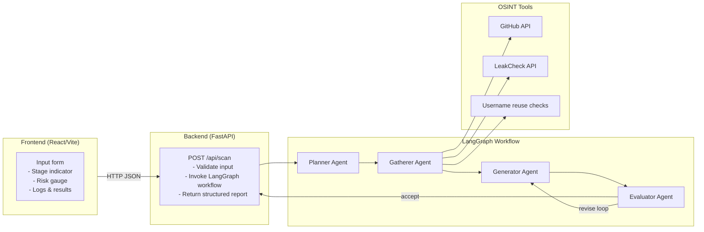

# FootprintGuard  
Multi-Agent Digital Footprint Risk Assessment Workflow (LangGraph + Gemini)

FootprintGuard is a full-stack application that analyzes a person’s public digital footprint (GitHub, email breach exposure, username reuse across platforms, etc.) and produces a structured cyber risk assessment with mitigation advice.

The system combines:

- A React + Vite frontend for structured input and risk visualization.
- A FastAPI backend exposing a `/api/scan` endpoint.
- A LangGraph workflow orchestrating four Gemini-powered agents (Planner → Gather → Generate → Evaluate).
- Real OSINT-style tools for GitHub, email breach checks (LeakCheck public API), and username reuse detection.

The project emphasizes structured reasoning, bounded agent execution, and evidence-backed risk scoring.

---

## Features

- Multi-source OSINT: GitHub public profile, email breach exposure, username reuse across major platforms.
- Agentic workflow: Planner, Gatherer, Generator, Evaluator agents coordinated via LangGraph.
- LLM-augmented reasoning: Gemini 2.5 Flash (via `langchain-google-genai`) for planning, report generation, and strict evaluation.
- Structured output: Normalized risk score (0–100), risk level (Low/Medium/High), risk factors, and mitigation steps.
- Interactive UI: Stage indicators, terminal-style agent logs, and structured risk visualization.

---

## Design Principles

FootprintGuard was built with the following architectural goals:

- Deterministic task selection via a whitelisted planner agent.
- Strict JSON enforcement for report generation.
- Evidence-backed reasoning validated by an evaluator agent.
- Limited revision loop to prevent uncontrolled agent recursion.
- Clear separation of concerns between planning, tool execution, generation, and validation.

The system prioritizes structured reasoning and reproducibility over free-form LLM output.

---

## Architecture Diagram



---

## Why LangGraph?

LangGraph was chosen to model the workflow as a stateful directed graph with conditional transitions.

Benefits:

- Explicit state transitions.
- Controlled revision loops.
- Deterministic termination conditions.
- Clear separation between reasoning and tool execution.

This avoids uncontrolled prompt chaining and ensures bounded agent execution.

---

## Agent Breakdown

### Planner Agent
- Uses Gemini 2.5 Flash via `ChatGoogleGenerativeAI`.
- Normalizes user input.
- Selects tasks from a strict whitelist:
  - `check_breach_exposure`
  - `analyze_github_public_data`
  - `check_username_reuse`
  - `analyze_bio_exposure`
- Outputs structured JSON specifying tasks and normalized inputs.

### Information-Gathering Agent
- Executes selected tasks using:
  - GitHub public API
  - LeakCheck public API
  - Username reuse checks across major platforms
- Builds structured evidence dictionary for downstream reasoning.

### Generator Agent
- Converts structured evidence into a strictly formatted JSON risk report:
  - `risk_score` (0–100)
  - `risk_level`
  - `risk_factors`
  - `mitigations`

### Evaluator Agent
- Validates that every risk factor and mitigation is supported by evidence.
- Returns `accept` or `revise`.
- Enforces bounded revision loop to maintain control over agent execution.

---

## Backend Flow Overview

- Entry point: `POST /api/scan`
  - Validates and normalizes input.
  - Creates initial AgentState.
  - Invokes compiled LangGraph workflow.
  - Returns structured response with evidence and timestamp.

- Conditional graph logic:
  - Accept → persist final report.
  - Revise → limited loop back to generator.

---

## Frontend Flow Overview

- Collects user inputs (GitHub username, email, social handles, full name).
- Calls `POST /api/scan`.
- Displays:
  - Risk score gauge.
  - Risk factors.
  - Mitigation steps.
  - Evidence breakdown.
  - Agent-style execution logs.

---

## Environment Configuration

Sensitive configuration must never be committed.

Create `backend/.env` based on `backend/.env.example`:

```
GOOGLE_API_KEY=your_real_gemini_api_key_here
```

Ensure the variable is available in your environment before starting the backend.

---

## Running Locally

### Backend

```bash
cd backend
python -m venv .venv
source .venv/bin/activate
pip install -r requirements.txt
uvicorn api:app --host 0.0.0.0 --port 8000 --reload
```

Endpoints:
- `GET /health`
- `GET /api/tools/status`
- `POST /api/scan`

### Frontend

```bash
npm install
npm run dev
```

Ensure backend runs on `http://localhost:8000`.

---

## Example API Response

```json
{
  "riskScore": 62,
  "riskLevel": "High",
  "riskFactors": [
    "Email found in multiple data breaches",
    "Public commit email exposed on GitHub",
    "Username reused across multiple platforms"
  ],
  "mitigations": [
    "Enable two-factor authentication",
    "Rotate compromised passwords",
    "Use GitHub noreply email",
    "Separate professional and personal usernames"
  ],
  "evidence": {
    "email": { "found_in_breaches": true },
    "github": { "commit_email_exposed": true },
    "username": { "reuse_count": 3 }
  }
}
```

---

## Deployment Notes

This project is intended to run locally due to:

- Dependence on Gemini API keys.
- Live OSINT lookups.
- LLM-driven validation loops.

Public deployment is intentionally avoided to prevent API key exposure and rate-limit issues.

A demo walkthrough video can be added here:
(Insert Loom/YouTube link)

---

## Future Improvements

- Additional OSINT integrations.
- Persistent scan history.
- Authentication and per-user dashboards.
- Report export (PDF).
- Integration with security monitoring platforms.
